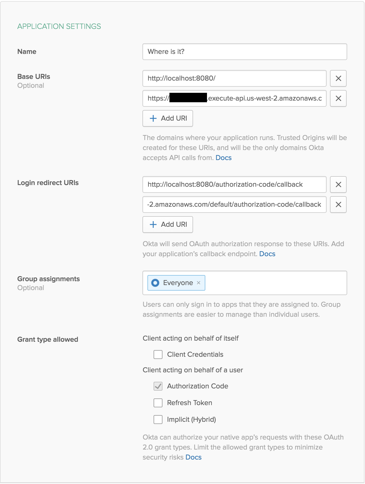

# Example Secure AWS Lambda App

This is an example API that can be run locally or in AWS Lambda. Given longitude and latitude it finds some information about the location. The app is protected behind authentication provided by Okta. For more information on how to set it up with AWS, visit the [Okta developer blog](https://developer.okta.com/blog/).

**Prerequisites**: [Node.js](https://nodejs.org/en/).

## Getting Started

To install this example application, run the following commands:

```bash
git clone git@github.com:oktadeveloper/okta-nodejs-aws-lambda-example.git
cd okta-nodejs-aws-lambda-example
npm install
```

This will install a local copy of the project. You will need to set up some environment variables before the app will run properly.

To integrate Okta's Identity Platform for user authentication, you'll first need to:

* [Sign up for a free Okta Developer account](https://www.okta.com/developer/signup/)
* You will get a URL similar to `https://dev-123456.oktapreview.com`.
  * Save this URL for later
  * You will also use this URL to login to your Okta account

You will need to create an application in Okta:

* Log in to your Okta account, then navigate to **Applications** and click the **Add Application** button
* Select **Web** and click **Next**
* Give your application a name (e.g. "Where is it?")
* If you're using this within AWS Lambda, add a **Base URI** pointing to your API Gateway (e.g. `https://asdf.execute-api.us-west-2.amazonaws.com/` and a **Login redirect URI** pointing to the callback route, with the API Gateway's stage prefix (e.g. `https://asdf.execute-api.us-west-2.amazonaws.com/default/authorization-code/callback`, then click **Done**
* Save your **Client ID** and **Client Secret** for later

Your Okta application should have settings similar to the following:



Now create a file called `.env` in the project root and add the following variables, replacing the values with your own from the previous steps.

**.env**
```bash
OKTA_ORG_URL=https://{yourOktaOrgUrl}
OKTA_CLIENT_ID={yourClientId}
OKTA_CLIENT_SECRET={yourClientSecret}
```

You also need an app secret. One way to get a random `APP_SECRET` is to use the following commands, which will generate a random value and add it to your `.env` file.

```bash
npm install -g uuid-cli
echo "APP_SECRET=`uuid`" >> .env
```

Now you can run the server with the following command:

```bash
node .
```

## Links

This example uses the [Okta Node SDK](https://github.com/okta/okta-sdk-nodejs) and the [Okta JWT Verifier](https://github.com/okta/okta-oidc-js/tree/master/packages/jwt-verifier).

**IMPORTANT**: When deploying application to AWS Lambda, make sure to upload your NPM dependencies. https://stackoverflow.com/questions/34437900/how-to-load-npm-modules-in-aws-lambda

## Help

Please [raise an issue](https://github.com/oktadeveloper/okta-nodejs-aws-lambda-example/issues) if you find a problem with the example application, or visit our [Okta Developer Forums](https://devforum.okta.com/). You can also email [developers@okta.com](mailto:developers@okta.com) if would like to create a support ticket.

## License

Apache 2.0, see [LICENSE](LICENSE).
